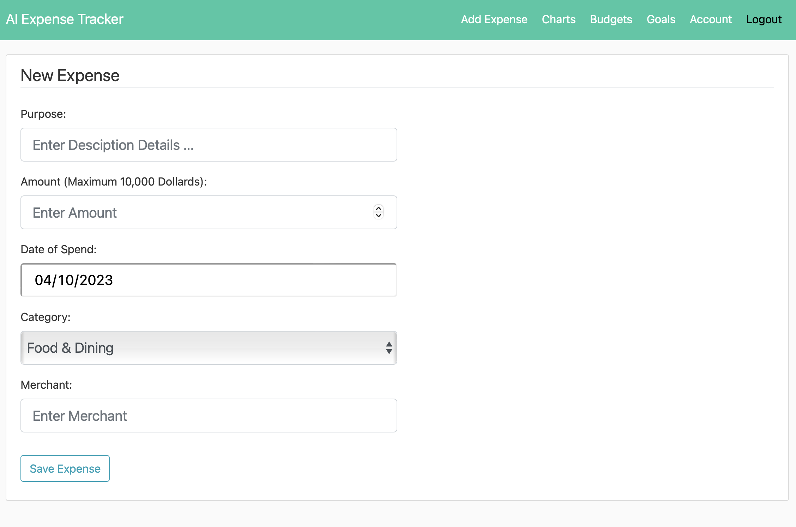
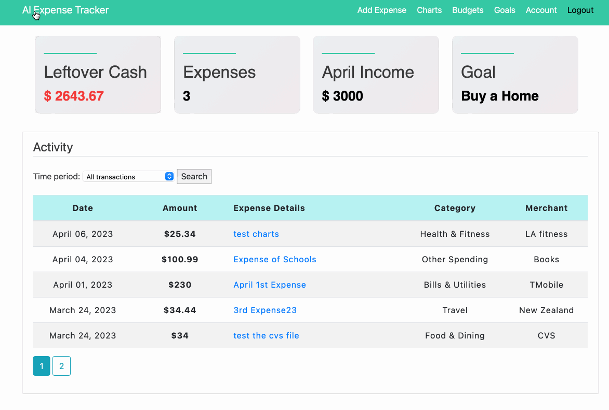
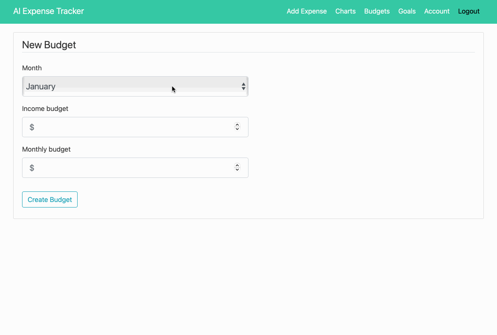
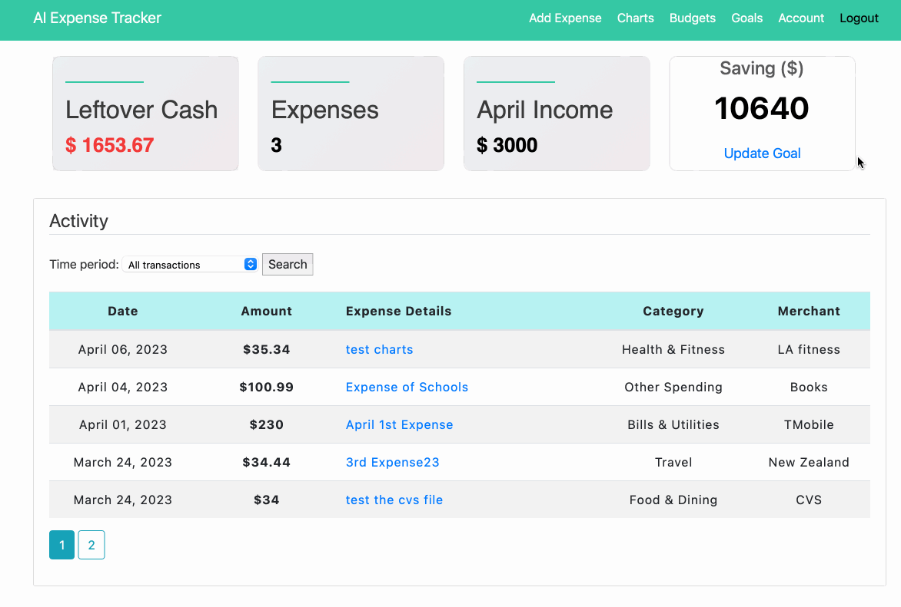
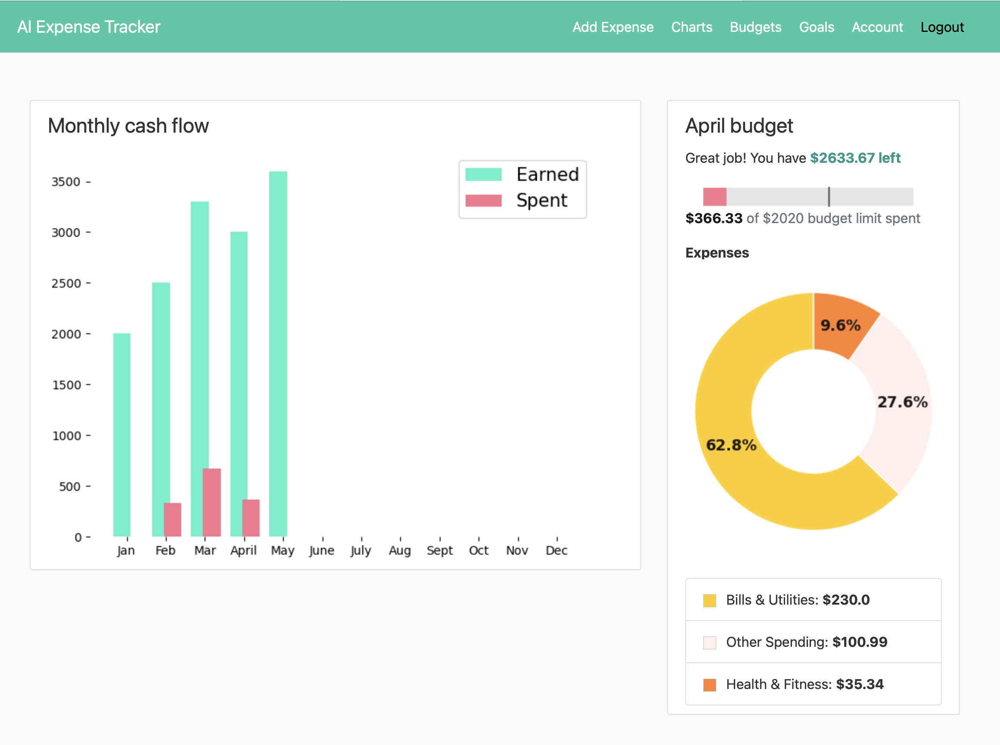
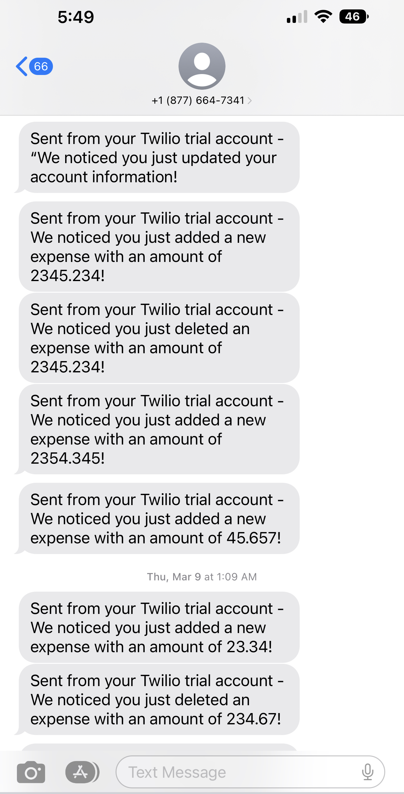

<!-- PROJECT LOGO -->

  <h1 align="center">AI-Expense Saving App</h3>

  

    🥳 Introducing an innovative AI-powered expense-saving app designed to assist users in achieving their personal financial goals. The app is equipped with advanced AI and ML algorithms, enabling it to deliver personalized responses based on each user's unique financial situation. The app allows users to manage and track their expenses effectively, receiving summary alerts via SMS messages.
  

   
  

    One standout feature of the app is its ability to provide tailored responses to user queries related to their finances. For instance, users can ask questions like "do I have enough funds to buy a particular product without impacting my target goal?" The app's assistant will leverage graphs and data-driven insights to provide precise and personalized answers.
  

  

Furthermore, the app allows users to set a limit of spare change, which the app will set aside as savings, improving the overall financial wellness of the user. This app is a game-changer for anyone looking to save money and achieve their financial goals!
  

  <h2>Expense form</h2>
  
Expense form is designed to capture all relevant expense data including amount, certain categories, departments. 

  
  <h2>Expense dashboard</h2>
  
The expense dashboard is the central location where user can view expenses of the current month across different fields such as Cash, Budget, and Goal.

  
  <h2>Budgets</h2>
  
The Budget is where user can view/create monthly budget, which includes income, the budget that has been set, and any remaining cash.

  
  <h2>Goals</h2>
  
The Goal is where user can view/create the financial goals with personalized spending targets.

  
  <h2>Charts</h2>
  
The Charts help user analyze expenses month by month and move closer to the financial goals.

  
  <h2>Real-time expense managements</h2>
  
Get instant notifications on expenses or updated information via text, and receive real-time transaction data

  

<!-- DESIGN SYSTEM -->
<h2 align="center">DESIGN SYSTEM</h2>

🧐 To get a big picture of how I develop this app

<h3>Preliminary List of Key Features</h3>

- **Registration/Login**: Use **TOTP** and **Google Two-factor Authenticator** in _Python_ to make sure that users’ log-in flow is secured and no unauthorized person can get into the account. Also, **BCrypt Algorithm** is used to hash and save passwords securely. Unique **Login** for each user, i.e. no two users can have the same username, email and phone number.
- **User profile**: Take care of personalization of user (e.g., Name, Email, Password, Phone, ect.).
- **Tracking expenses**: The data for the expense report is taken from users inputs.
- **Financial Goals**: Provide a range of predefined goals covering options such as paying off credit card debt or savings, leaving users the chance to create their own goals.
- **Compliance**: Let users automate their savings by setting spending limits or automatically saving their spare change from daily purchases.
- **Analytics and reports**: Display categories through visible _charts_ that give users a detailed view (_Net Income Over Time Chart, Total Monthly Expenses Chart, Expenses Breakdown Chart_). Define all users transactions based on categories such as Income, Restaurant, Gas, ect. Use **Pandas** for analytical processing and _Data Visualizaiton_ with **Mathplotlib**.
- **Predict money flow**: As analyzing users financial situation, the app delivers financial suggestions when being asked that help users know where they can invest and increase capital. Use the **System Design and Recommendation algorithm** concepts in order to make decisions by feeding said data.
- **Notifications and Alerts**: Users will receive SMS Notifications when they _Update Account Information_ or _Add/Edit/Delete a Transaction_ (**Twilio API** and **Python**).
- **Deployments**: Heroku and AWS.
- **Agile automations**: Zenhub.

<!-- SQL -->
 
<h3>Relational Databases</h3>

The following diagram shows which tables will be created and what is their One-to-Many relationship.

The application has 4 tables:

1. Users will store the personal data of user such as name, email, password.
2. Expenses will store the information about the type of expenses, a description, the date of purchase/expense and finally the amount spent.
3. Budgets will store the user's monthly income and limit of spare change.
4. Goals will store user's saving purpose to achieve.

<!-- TECH STACK -->

## 👨‍💻 Tech Stack

Here's a brief high-level overview of the tech stack the app uses:

1. Web Framework: **Flask**
2. Front-end Library: **Bootstrap**
3. HTML forms with our Flask server: **Flask-WTF**
4. Storing User Data: **SQLAlchemy**
5. Advanced Database: **SQLLite** for testing and **PostgreSQL** for production
6. SMS memssage: **Twilio API** and **Python**
7. Essential data science tool: **Pandas**
8. Data visualization tool: **Mathplotlib**, **Plotly**

<!-- ZENHUB -->

## 🚀 Release Notes

1. Created **Login/Register** feature pages
2. Set up a **Database** and Stored User Data with SQLAlchemy
3. Created **User Authentication** to keep passwords and information safe using `BCrypt Algorithm`
4. Implemented **TOTP 2FA** with **Google Authenticator** in Python and Flask when logging in
5. Created **User Account** feature with Profile picture where user can update their info
6. Created **Add Expense** feature in navbar so that user can now add a new expense
7. Created **Table view of Expenses** feature in homepage contains the list of all transactions, sorted with newest date of spend.
8. Created **Expense Details** feature where user can review/update/delete expense's details
9. Created **Edit/Delete** feature so that user can now edit/delete an existing expense
10. Created **Pagination** feature for pages
11. Sending **SMS via the Twilio API**. Message will be sent out when users register new account, update account info, add/edit/delete an expense.
12. Created **Goal** feature where user can now create/update/delete a new saving goal
13. Created **Budget** feature where user can now create a new monthly budget to keep track the expenses and achieve the goal
14. Enhanced **Home Page** UI features that help users track income, budget, savings, and spending.
15. Created **Goals** and **Budgets** features which provide a summary for saving and budget.
16. Created **Sorting** features for expenses based on time period.
17. Read/Write/Update data analysis with **Pandas**
18. Created **Charts** feature to show full detailed records of expenses through charts.

<!-- DOCUMENTATION -->

## Documentation

The documentation for this app can be found [here](https://github.com/tnguyen606-cs/AI-ExpenseApp/tree/main/Documentation).
