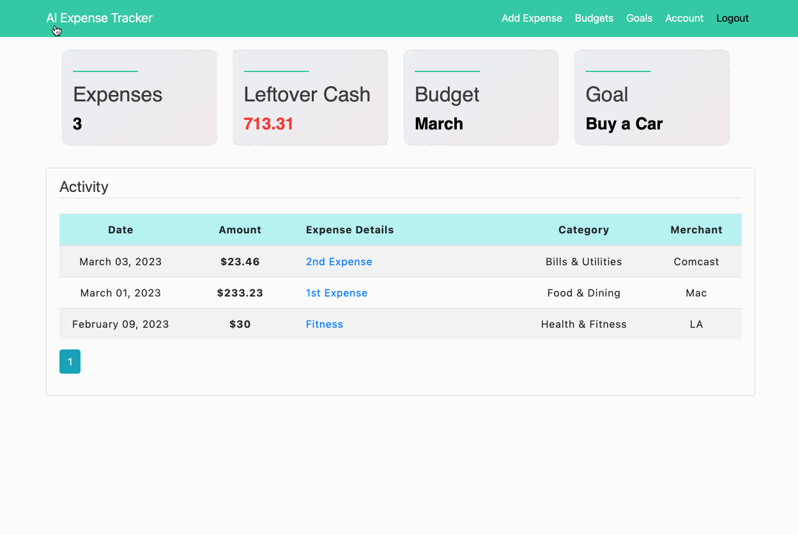

<!-- PROJECT LOGO -->
<p align="center">

  <h1 align="center">AI-Expense Saving App</h3>

  <p align="center">
    🥳 An awesome AI-powered expense-saving app to jumpstart that helps users in saving little by little for personal goals by managing and tracking users expenses and send summary alerts via SMS message. 
  </p>
  <br/>
  <p>
    Further, AI and ML are at the core of the App. Its AI and ML algorithms help the platform deliver tailored responses based on users personal finances. For instance, one can even ask questions such as "whether I have the budget to buy a particular product that should not hurt the target goal" — then, the assistant of the app will take a dive into the graphs and data-driven insights and would answer queries. That is not all, the users can also set a limit of spare changes on the App and the app will put that amount aside as users savings, which helps to improve users overall financial wellness.
  </p>

  
</p>

<!-- DESIGN SYSTEM -->
<h2 align="center">DESIGN SYSTEM</h2>

<p align="center">🧐 To get a big picture of how I develop this app</p>

<details>
  <summary>
    <h3>Preliminary List of Key Features</h3>
  </summary>

- **Registration/Login**: Use **TOTP** and **Google Two-factor Authenticator** in _Python_ to make sure that users’ log-in flow is secured and no unauthorized person can get into the account. Also, **BCrypt Algorithm** is used to hash and save passwords securely. Unique **Login** for each user, i.e. no two users can have the same username, email and phone number.
- **User profile**: Take care of personalization of user (e.g., Name, Email, Password, Phone, ect.).
- **Tracking expenses**: The data for the expense report is taken from users inputs.
- **Financial Goals**: Provide a range of predefined goals covering options such as paying off credit card debt or savings, leaving users the chance to create their own goals.
- **Compliance**: Let users automate their savings by setting spending limits or automatically saving their spare change from daily purchases.
- **Analytics and reports**: Display categories through visible _charts_ that give users a detailed view (_Net Income Over Time Chart, Total Monthly Expenses Chart, Expenses Breakdown Chart_). Define all users transactions based on categories such as Income, Restaurant, Gas, ect. Use **PostgreSQL** for analytical processing and _Data Visualizaiton_ with **Mathplotlib**.
- **Predict money flow**: As analyzing users financial situation, the app delivers financial suggestions when being asked that help users know where they can invest and increase capital. Use the **System Design and Recommendation algorithm** concepts in order to make decisions by feeding said data.
- **Notifications and Alerts**: Users will receive SMS Notifications when they _Update Account Information_ or _Add/Edit/Delete a Transaction_ (**Twilio API** and **Python**).
- **Deployments**: Heroku and AWS.
- **Agile automations**: Zenhub.

</details>

<!-- TECH STACK -->
<br/>
<h2>👨‍💻 Tech Stack</h2>

Here's a brief high-level overview of the tech stack the app uses:

1. Web Framework: **Flask**
2. Front-end Library: **Bootstrap**
3. HTML forms with our Flask server: **Flask-WTF**
4. Storing User Data: **SQLAlchemy**
5. Advanced Database: **SQLLite** for testing and **PostgreSQL** for production
6. SMS memssage: **Twilio API** and **Python**

<!-- ZENHUB -->
<br/>
<h2>🚀 Release Notes</h2>
  
  1. Created **Login/Register** feature pages
  2. Set up a **Database** and Stored User Data with SQLAlchemy
  3. Created **User Authentication** to keep passwords and information safe using `BCrypt Algorithm`
  4. Implemented **TOTP 2FA** with **Google Authenticator** in Python and Flask when logging in
  5. Created **User Account** feature with Profile picture where user can update their info
  6. Created **Add Expense** feature in navbar so that user can now add a new expense
  7. Created **Table view of Expenses** feature in homepage contains the list of all transactions, sorted with newest date of spend.
  8. Created **Expense Details** feature where user can review expense's details
  9. Created **Edit/Delete** feature so that user can now edit/delete an existing expense
  10. Created **Pagination** feature for pages
  11. Sending **SMS via the Twilio API**. Message will be sent out when users register new account, update account info, add/edit/delete an expense.
  12. Created **Goal** feature where user can now create a new saving goal
  12. Created **Budget** feature where user can now create a new monthly budget to keep track the expenses and achieve the goal
  13. Enhanced **Home Page** UI features that displays all spending expenses, goals, budgets, and leftover cash.

<!-- DOCUMENTATION -->
<br/>
<h2>Documentation</h2>

The documentation for this app can be found [here](https://github.com/tnguyen606-cs/AI-ExpenseApp/tree/main/Documentation).

### A top-level directory structure

```bash
    .
    ├── Documentation
    │   ├── Flask-WTF.md
    │   ├── SQLAlchemy.md
    │   └── Setup Process.md
    ├── LICENSE
    ├── README.md
    ├── app                     # The main Flask application directory
    │   ├── __init__.py         # A special file to make the app a package for imports to work properly
    │   ├── config.py
    │   ├── models.py           # The file that will contain Flask-SQLAlchemy models.
    │   ├── users               # The users blueprint for managing users
    │   │   ├── __init__.py
    │   │   ├── forms.py
    │   │   ├── routes.py
    │   │   └── utils.py
    │   ├── expenses            # The expenses blueprint of expenses
    │   │   ├── __init__.py
    │   │   ├── forms.py
    │   │   ├── routes.py
    │   │   └── utils.py
    │   ├── budgets             # The budgets blueprint of monthly budget
    │   │   ├── __init__.py
    │   │   ├── forms.py
    │   │   ├── routes.py
    │   │   └── utils.py
    │   ├── goals             # The goals blueprint of saving goal
    │   │   ├── __init__.py
    │   │   ├── forms.py
    │   │   ├── routes.py
    │   │   └── utils.py
    │   ├── main                # The main blueprint serving as the home page
    │   │   ├── __init__.py
    │   │   └── routes.py
    │   ├── static
    │   │   ├── images
    │   │   │   ├── 54b147f2e1c9f467.png
    │   │   │   ├── 78442eb9768a5147.png
    │   │   │   ├── 980c76b8223154fa.png
    │   │   │   └── a7d950e43d1cc7ad.png
    │   │   └── main.css
    │   ├── templates           # The templates directory contains files for all blueprints.
    │   │   ├── account.html
    │   │   ├── create_budget.html
    │   │   ├── create_expense.html
    │   │   ├── create_goal.html
    │   │   ├── expense.html
    │   │   ├── home.html
    │   │   ├── layout.html
    │   │   ├── login.html
    │   │   ├── main.html
    │   │   ├── register.html
    │   │   └── two_factor_setup.html
    ├── instance
    │   └── user_info.db
    └── run.py
```
